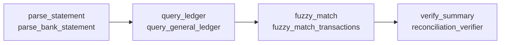

# Reco Benchmark Suite: Bank & Ledger Reconciliation (`reconciliation-v1`)

## 1. Overview & Purpose

Reco is an Autonomous Agent Engineering System (Track 1: Automated Agent Engineering). The system operates on the core loop:

$$\text{Goal} \longrightarrow \text{Architecture} \longrightarrow \text{Execute} \longrightarrow \text{Evaluate} \longrightarrow \text{Diagnose} \longrightarrow \text{Mutate} \longrightarrow \text{Compare} \longrightarrow \text{Promote}$$

Financial bank and ledger reconciliation serves as the first standardized benchmark domain for Reco. The purpose of `reconciliation-v1` is to provide a deterministic, objective, and reproducible evaluation harness to evaluate synthesized agent architectures, measure improvements, and gate promotions without LLM evaluation bias or data leakage.

---

## 2. Benchmark Versioning & Reproducibility

- **Benchmark Identifier**: `reconciliation`
- **Benchmark Version**: `reconciliation-v1`
- **Reproducibility Invariants**:
  - Zero runtime random data generation (`random` or unseeded generators are strictly prohibited).
  - All financial numbers use exact Python `Decimal` arithmetic.
  - Case codes and scenario input data are static and immutable.
  - Case execution ordering is deterministic.
  - Ground truth is fully deterministic and hard-coded; no LLM evaluation is used in the evaluation harness.

---

## 3. Dataset Structure & 12/8 Split Protocol

The canonical dataset contains **exactly 20 cases**, partitioned into two strictly isolated sets:

| Split | Case Count | Purpose | Case Code Range |
| :--- | :--- | :--- | :--- |
| **Optimization** | 12 | Root-cause diagnosis, failure clustering, and architecture mutation. | `REC-OPT-01` to `REC-OPT-12` |
| **Held-Out** | 8 | Final promotion gating and regression validation (isolated from mutation). | `REC-HLD-01` to `REC-HLD-08` |

### Experimental Protocol Isolation
1. **No Data Leakage**: Optimizer-facing routines only request `load_cases("optimization")`.
2. **Explicit Filtering**: Code requesting benchmark scenarios must explicitly pass the target split (`"optimization"` or `"held_out"`).
3. **Promotion Gating**: Candidate agent mutations are only promoted if they demonstrate improvement on optimization cases AND maintain non-regressive performance on held-out cases.

---

## 4. Complete 20-Case Inventory

### Optimization Set (12 Cases)
| Case Code | Exception Category | Difficulty | Description | Primary Ground Truth |
| :--- | :--- | :--- | :--- | :--- |
| `REC-OPT-01` | `exact_match` | Easy | Single exact match ($1,500.00, Acme Corp, INV-1001) | Match pair, diff $0.00 |
| `REC-OPT-02` | `near_match` | Easy | Minor vendor suffix ('Amazon Web Services Inc' vs 'Amazon Web Services') | Match pair, diff $0.00 |
| `REC-OPT-03` | `processing_fee` | Medium | Merchant processor 2.9% gross fee ($1,000 gross - $29 = $971 net) | Match pair, diff $29.00 |
| `REC-OPT-04` | `timing_difference`| Easy | 4-day settlement clearing lag (FedEx Freight) | Match pair, diff $0.00 |
| `REC-OPT-05` | `duplicate` | Medium | Bank duplicate charge for single ledger entry ($325.50 Office Depot) | 2 duplicate pairs |
| `REC-OPT-06` | `missing_transaction` | Medium | Bank wire service fee ($35.00) missing from ledger | Unmatched bank TX-OPT-602 |
| `REC-OPT-07` | `missing_transaction` | Medium | Booked vendor payment ($600.00) missing from bank | Unmatched ledger GL-OPT-702 |
| `REC-OPT-08` | `wrong_vendor` | Hard | Identical amount ($750.00) but unrelated vendors (Apex vs Delta Hotel) | 0 pairs, no false match |
| `REC-OPT-09` | `wrong_amount` | Medium | Typographical amount mismatch ($1,280.00 vs $1,200.00 Hardware Depot) | Match pair, diff $80.00 |
| `REC-OPT-10` | `transposition` | Hard | Digit transposition ($540.00 vs $450.00, diff $90 divisible by 9) | Match pair, diff $90.00 |
| `REC-OPT-11` | `fx_difference` | Hard | Foreign exchange currency settlement variance ($1,085 vs $1,000) | Match pair, diff $85.00 |
| `REC-OPT-12` | `compound_exception`| Hard | 2.9% fee ($58 on $2,000) + 2-day timing delay + vendor suffix | Compound pair, diff $58.00 |

### Held-Out Set (8 Cases)
| Case Code | Exception Category | Difficulty | Description | Primary Ground Truth |
| :--- | :--- | :--- | :--- | :--- |
| `REC-HLD-01` | `exact_match` | Easy | Multi-line exact match batch ($3,100.00 DataCorp, $1,450.25 Nordic) | 2 exact match pairs |
| `REC-HLD-02` | `near_match` | Medium | Vendor suffix variation ('Google Cloud Platform' vs 'Google Cloud') | Match pair, diff $0.00 |
| `REC-HLD-03` | `processing_fee` | Medium | Square POS fee ($500.00 gross - $14.50 fee = $485.50 net) | Match pair, diff $14.50 |
| `REC-HLD-04` | `timing_difference`| Easy | Weekend settlement delay across 4 calendar days ($5,200.00) | Match pair, diff $0.00 |
| `REC-HLD-05` | `duplicate` | Hard | Duplicate accrual booking in ledger for single bank charge | 2 duplicate pairs |
| `REC-HLD-06` | `transposition` | Hard | Digit transposition ($730.00 vs $370.00, diff $360 divisible by 9) | Match pair, diff $360.00 |
| `REC-HLD-07` | `missing_transaction` | Medium | Disputed bank charge ($245.00) not present in general ledger | Unmatched bank TX-HLD-702 |
| `REC-HLD-08` | `compound_exception`| Hard | FX variance ($2,170 vs $2,000) + 3-day timing delay + vendor suffix | Compound pair, diff $170.00 |

---

## 5. Ground Truth Design

Every benchmark case defines deterministic ground truth via `ReconciliationGroundTruth`:
- `expected_pairs`: Explicit list of expected match pairings `(bank_transaction_id, ledger_entry_id)`.
- `unmatched_bank_ids`: Identifiers of bank transactions that must remain unmatched.
- `unmatched_ledger_ids`: Identifiers of ledger entries that must remain unmatched.
- `primary_exception`: Canonical exception class identifier.
- `expected_exceptions`: Dictionary of expected exception counts by classification name.
- `total_discrepancy`: Sum of all monetary differences in exact `Decimal`.
- `verification_rules`: Audit check invariants (e.g., `"exact_amount_match"`, `"transposition_rule_of_nine_verified"`).

---

## 6. Evaluation Formulas & Scoring Model

The evaluator implements a transparent, deterministic composite scoring formula:

$$\text{Case Accuracy} = 0.40 \cdot S_{\text{match}} + 0.40 \cdot S_{\text{exception}} + 0.20 \cdot S_{\text{discrepancy}}$$

### Sub-Score Definitions

1. **Pair Matching Score ($S_{\text{match}} \in [0.0, 1.0]$)**:
   - For cases expecting pairs: $F_1$ score on true positive matched pairs:
     $$\text{Precision} = \frac{|A_{\text{pairs}} \cap E_{\text{pairs}}|}{|A_{\text{pairs}}|}, \quad \text{Recall} = \frac{|A_{\text{pairs}} \cap E_{\text{pairs}}|}{|E_{\text{pairs}}|}, \quad F_1 = \frac{2 \cdot \text{Precision} \cdot \text{Recall}}{\text{Precision} + \text{Recall}}$$
   - For cases where no match should exist (`wrong_vendor`): 1.0 if 0 pairs produced, 0.0 if false matches hallucinated.
   - For missing transaction cases: Includes weighted accuracy on correctly isolating unmatched bank/ledger sets.

2. **Exception Classification Score ($S_{\text{exception}} \in [0.0, 1.0]$)**:
   - Fraction of correctly matched pairs that have the exact expected `match_type` (e.g. `processing_fee`, `timing_difference`, `duplicate`, `transposition`).
   - Partial credit (0.50) for identifying components of compound exceptions.

3. **Discrepancy Amount Score ($S_{\text{discrepancy}} \in [0.0, 1.0]$)**:
   - Exact variance matching: 1.0 if $|\text{Actual Discrepancy} - \text{Expected Discrepancy}| \le \$0.01$.
   - Linear penalty scaled by magnitude of discrepancy error if inaccurate.

### Case Pass Threshold
A case is recorded as `success = True` if and only if:
$$\text{Accuracy Score} \ge 0.80 \quad \text{AND} \quad \text{Reliability Score} == 1.0$$

---

## 7. Metrics Definitions

| Metric | Definition | Scale | Notes |
| :--- | :--- | :--- | :--- |
| **Accuracy** | Mean composite accuracy score across all benchmark cases in the run. | `0.0` to `1.0` | Transparent deterministic formula. |
| **Reliability** | Fraction of cases that completed successfully without fatal execution errors. | `0.0` to `1.0` | Checks execution status and schema validity. |
| **Total Cost** | Sum of execution cost across all node executions and inference calls. | USD (`$`) | Labelled as `simulated_mock` when using MockGateway. |
| **Average Latency**| Total wall-clock execution duration divided by number of cases. | Milliseconds (`ms`) | In-process sequential execution. |
| **Total Latency**  | Total cumulative wall-clock execution time for all cases in the split. | Milliseconds (`ms`) | Aggregate run duration. |

---

## 8. Manual Baseline Agent (V0)

The benchmark includes a canonical manual 4-stage baseline architecture (`create_reconciliation_baseline_graph`):

- **Metadata**: Tagged explicitly with `generation_method = "manual_baseline"`.
- **Performance**:
  - **Reliability**: 1.0000 (100% completion without crash)
  - **Optimization Accuracy**: ~0.7500 (75.0% accuracy, 8/12 cases passed threshold)
  - **Held-Out Accuracy**: ~0.7500 (75.0% accuracy, 5/8 cases passed threshold)
  - **Execution Latency**: < 50ms per run offline.
- **Baseline Role**: Serves as the comparison watermark ($V_0$) against which future synthesized and mutated architectures ($V_1, V_2, \dots$) are evaluated.

---

## 9. Architecture Compatibility & Persistence

`ReconciliationBenchmark` implements the `reco.core.interfaces.Benchmark` interface and works directly with `AgentGraphRuntime`:
- Runs in-memory without requiring live Supabase credentials for testing.
- When repositories are provided, records:
  - `BenchmarkRunRecord` into `BenchmarkRunRepository`.
  - `CaseExecutionRecord` (with latency, tokens, cost, tool events, and trace ID) into `CaseExecutionRepository`.
  - Can run with persistence disabled (`persist=False`).
