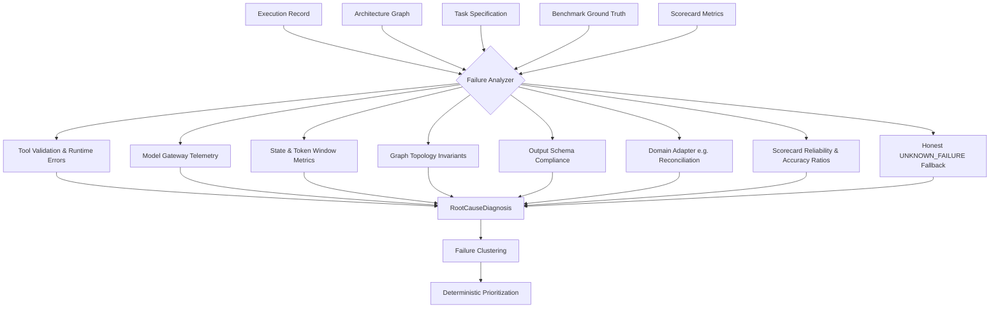

# Reco — Failure Analyzer & Root Cause Diagnoser

**Autonomous Agent Engineering System (Track 1: Automated Agent Engineering)**  
**Milestone 9 Documentation**

---

## 1. Overview & Architectural Role

In the Reco autonomous engineering loop:

$$\text{Goal} \rightarrow \text{Architecture} \rightarrow \text{Execute} \rightarrow \text{Evaluate} \rightarrow \mathbf{Diagnose} \rightarrow \text{Mutate} \rightarrow \text{Re-run} \rightarrow \text{Compare} \rightarrow \text{Promote}$$

The **Failure Analyzer** operates at the diagnostic pivot point:
$$\text{EXECUTE} \rightarrow \text{EVALUATE} \rightarrow \mathbf{DIAGNOSE}$$

Its sole responsibility is to answer five fundamental questions for any execution failure or benchmark anomaly:
1. **What failed?** (Failure Category from a strictly defined taxonomy)
2. **Where did it fail?** (`failed_node_id`, `failure_source`)
3. **Why did it fail?** (Deep root-cause explanation distinct from the observable symptom)
4. **What evidence supports that diagnosis?** (Structured, verifiable telemetry from tools, ground truth, or execution trace)
5. **What type of change would likely fix it?** (Targeted, structured `RecommendedMutation` referencing real nodes/tools)

It does **not** perform mutations, optimize architectures, or synthesize $V_1$. It produces structured, actionable diagnostic intelligence for the future Mutation Engine.

---

## 2. Core Failure Taxonomy

Failures are classified into 12 mutually exclusive, evidence-grounded categories:

| Category | Description | Primary Evidence Source | Example Mutation Type |
|---|---|---|---|
| `TOOL_ARGUMENT_ERROR` | Parameter validation failure or schema violation during tool call | Tool audit event / ToolExecutor | `PROMPT_CHANGE` |
| `TOOL_RUNTIME_ERROR` | Tool crashed or threw an unhandled runtime/system exception | Tool audit event / execution error | `RETRY_POLICY_CHANGE` |
| `ARITHMETIC_MISMATCH` | Mathematical discrepancy between computed and expected values | Ground truth comparison | `TOOL_ADD` / `PROMPT_CHANGE` |
| `PREMATURE_TERMINATION` | DAG stalled or exited before reaching designated terminal node(s) | Node step history / graph definition | `TOPOLOGY_CHANGE` |
| `HALLUCINATED_MATCH` | Matcher produced false positive contradicted by ground truth | Ground truth / evaluator | `PROMPT_CHANGE` / `ADD_VERIFIER` |
| `CONTEXT_OVERFLOW` | Token window exceeded or state compaction dropped critical data | State error / model gateway | `CONTEXT_CHANGE` / `MEMORY_CHANGE` |
| `MISSING_TOOL` | Required capability lacks an assigned tool binding | Task spec vs architecture DAG | `TOOL_ADD` |
| `WRONG_TOOL_SELECTION` | Node selected an unsuitable tool for the requested operation | Execution error / tool registry | `TOOL_REMOVE` / `TOOL_ADD` |
| `MISSING_VERIFICATION` | Evaluator requires verification but DAG lacks audit node | Evaluator spec vs graph topology | `ADD_VERIFIER` |
| `OUTPUT_SCHEMA_ERROR` | Terminal node output omitted mandatory JSON schema keys | Schema validator / terminal output | `PROMPT_CHANGE` |
| `MODEL_FAILURE` | Model gateway HTTP error, rate limit, or provider crash | Model gateway error trace | `MODEL_CHANGE` |
| `UNKNOWN_FAILURE` | Insufficient telemetry signals to determine root cause | Fallback telemetry | *(None — avoids false certainty)* |

---

## 3. Multi-Signal Diagnostic Pipeline

The `FailureAnalyzer` consumes multiple orthogonal execution signals:



### Signal Hierarchy
1. **Tool Invocation Signals**: Checks `ExecutionState.tool_events` for parameter validation errors (`TOOL_ARGUMENT_ERROR`) and tool crashes (`TOOL_RUNTIME_ERROR`).
2. **Model Gateway Signals**: Examines error logs for provider HTTP 500s or rate limit timeouts (`MODEL_FAILURE`).
3. **State Propagation Signals**: Checks for context length violations or compaction data loss (`CONTEXT_OVERFLOW`).
4. **Architecture Synthesis Signals**: Compares `TaskSpecification.required_tools` against `GraphDefinition.nodes[i].tools` (`MISSING_TOOL`, `WRONG_TOOL_SELECTION`).
5. **Topological Flow Signals**: Verifies whether terminal exit nodes (`GraphDefinition.terminal_node_ids`) executed (`PREMATURE_TERMINATION`).
6. **Output Integrity Signals**: Validates terminal output keys against `TaskSpecification.output_schema` (`OUTPUT_SCHEMA_ERROR`).
7. **Domain Diagnostic Adapters**: Hands off to domain-specific adapters (`ReconciliationDiagnosisAdapter`) to diagnose semantic nuances (fees, vendor matching, settlement lag).
8. **Scorecard Telemetry Signals**: Correlates degraded accuracy vs. degraded reliability to isolate semantic reasoning vs runtime stability defects.
9. **No False Certainty Fallback**: Assigns `UNKNOWN_FAILURE` with bounded low confidence when evidence is inconclusive.

---

## 4. Evidence Model & Telemetry Representation

Every diagnosis includes a list of structured `DiagnosisEvidence` items pointing directly to concrete execution attributes:

```json
{
  "source": "tool_event",
  "tool": "calculate_reconciliation_difference",
  "field": "arguments",
  "observed": {"amount": "invalid_string"},
  "expected": "Valid arguments matching tool schema",
  "details": {"error": "ValidationError: 'amount' must be a Decimal or float"}
}
```

or ground-truth discrepancies:

```json
{
  "source": "benchmark_ground_truth",
  "field": "primary_exception",
  "observed": ["wrong_amount"],
  "expected": "processing_fee",
  "details": {"expected_discrepancy": "2.50"}
}
```

---

## 5. Symptom vs. Root Cause Separation

The Failure Analyzer strictly enforces semantic separation between the **symptom** and the **root cause**:

- **Symptom**: The observable external failure or mismatch.
  - *Example*: `"Agent classified fee variance as generic 'wrong_amount' instead of 'processing_fee' in REC-OPT-03."`
- **Root Cause**: The underlying architectural defect, missing capability, or prompt bias that generated the symptom.
  - *Example*: `"The discrepancy classification pipeline does not check for characteristic payment processing fee percentages before classifying amount differences."`

---

## 6. Recommended Mutation Model

For each diagnosis, the analyzer generates targeted mutation recommendations for the future optimizer. Recommendations strictly target entities (nodes, tools, edges) that exist in the architecture:

| Mutation Type | Target Scope | Example Application |
|---|---|---|
| `PROMPT_CHANGE` | Node ID | Constrain vendor token matching threshold or date window tolerance |
| `TOOL_ADD` | Node ID | Bind fee-aware calculation tool to difference analysis node |
| `TOOL_REMOVE` | Node ID | Remove unhelpful tool to prevent tool misdirection |
| `TOOL_REORDER` | Node ID | Re-order candidate tool listings in system prompt |
| `TOPOLOGY_CHANGE` | Node / Graph | Insert fee-normalization node before classification stage |
| `ADD_VERIFIER` | Node ID | Insert post-matching auditor node to gate proposed pairs |
| `MEMORY_CHANGE` | Node ID | Add bounded episodic cache for recurring ledger items |
| `MODEL_CHANGE` | Node ID | Switch extraction node to higher-capability model |
| `ROUTING_CHANGE` | Edge / Node | Add conditional branch for discrepancy threshold routing |
| `CONTEXT_CHANGE` | Node ID | Project selective state keys rather than passing full graph state |
| `RETRY_POLICY_CHANGE` | Node ID | Configure retry policy on transient tool crash |

---

## 7. Failure Clustering & Deterministic Prioritization

### Clustering
Multiple case failures are clustered into `FailureCluster` groups using deterministic grouping on `(failure_category, root_cause_pattern)`.

### Prioritization
Clusters are assigned an interpretable priority score without opaque ML:

$$\text{Priority} = \text{frequency} \times \text{avg\_severity\_weight} \times \text{avg\_confidence} \times \text{benchmark\_multiplier}$$

Where:
- **Severity Weights**: `CRITICAL` = 4.0, `HIGH` = 3.0, `MEDIUM` = 2.0, `LOW` = 1.0.
- **Confidence**: Bounded diagnostic confidence score (0.0 to 1.0).
- **Benchmark Multiplier**: Boosted when benchmark scorecard shows substantial accuracy or reliability drops:
  $$\text{benchmark\_multiplier} = 1.0 + 1.5 \times (1.0 - \text{accuracy}) + 2.0 \times (1.0 - \text{reliability})$$

---

## 8. Domain-Specific Reconciliation Diagnoses

The `ReconciliationDiagnosisAdapter` maps domain anomalies to generic diagnoses:

1. **Processing Fee Mismatch**:
   - *Pattern*: Case has fee discrepancy (e.g., \$2.50 fee), but agent reported `wrong_amount`.
   - *Diagnosis*: `ARITHMETIC_MISMATCH` — Architecture lacks fee-aware discrepancy decomposition prior to exception classification.
   - *Recommendations*: `TOOL_ADD` (fee calculator), `TOPOLOGY_CHANGE` (pre-classification fee normalization).
2. **Wrong Vendor / False Match**:
   - *Pattern*: Agent matched records with identical amounts but distinct vendor entities.
   - *Diagnosis*: `HALLUCINATED_MATCH` — Matcher weighting overvalues amount and underweights vendor identity.
   - *Recommendations*: `PROMPT_CHANGE` (tighten vendor token thresholds), `ADD_VERIFIER` (counterparty audit node).
3. **Timing Difference (Clearing Lag)**:
   - *Pattern*: Transactions settle across date boundaries, agent reports unmatched items.
   - *Diagnosis*: `ARITHMETIC_MISMATCH` — Architecture lacks temporal window tolerance (e.g. $T \pm 3$ days).
   - *Recommendations*: `PROMPT_CHANGE` (introduce calendar window matching).
4. **Transposition Error**:
   - *Pattern*: Digit swap error (e.g. \$54.00 vs \$45.00, difference divisible by 9).
   - *Diagnosis*: `ARITHMETIC_MISMATCH` — Difference calculation lacks digit transposition test.
   - *Recommendations*: `PROMPT_CHANGE` (test differences for divisibility by 9).
5. **Compound Exception**:
   - *Pattern*: Multiple interacting anomalies; pipeline exits on first detected issue.
   - *Diagnosis*: `MISSING_VERIFICATION` — Discrepancy pipeline assumes single-cause anomalies.
   - *Recommendations*: `TOPOLOGY_CHANGE` (multi-factor decomposition step).

---

## 9. Persistence & API

### Persistence
Diagnoses are persisted directly into the existing `failure_diagnoses` table via `FailureDiagnosisRepository` (and `InMemoryFailureDiagnosisRepository` for isolated tests).

### API Endpoint
```http
POST /analyze-failure
Content-Type: application/json

{
  "execution_record": {
    "tool_events": [
      {
        "node_id": "worker",
        "tool_name": "calculate_reconciliation_difference",
        "success": false,
        "error": "ValidationError: missing required argument"
      }
    ]
  },
  "architecture": {
    "nodes": [{"node_id": "worker"}]
  }
}
```

Response:
```json
{
  "diagnosis_id": "3fa85f64-5717-4562-b3fc-2c963f66afa6",
  "failure_category": "TOOL_ARGUMENT_ERROR",
  "severity": "high",
  "failed_node_id": "worker",
  "failure_source": "tool_invocation",
  "symptom": "Tool 'calculate_reconciliation_difference' rejected invocation due to invalid arguments...",
  "summary": "Argument validation failed for tool 'calculate_reconciliation_difference' at node 'worker'.",
  "root_cause": "Node 'worker' generated arguments incompatible with tool parameters schema.",
  "confidence": 0.95,
  "recommended_mutations": [
    {
      "mutation_type": "PROMPT_CHANGE",
      "target": "worker",
      "rationale": "Node prompt does not enforce parameter constraints...",
      "expected_effect": "Ensures generated tool call payloads satisfy parameter validation schemas.",
      "confidence": 0.92
    }
  ]
}
```
