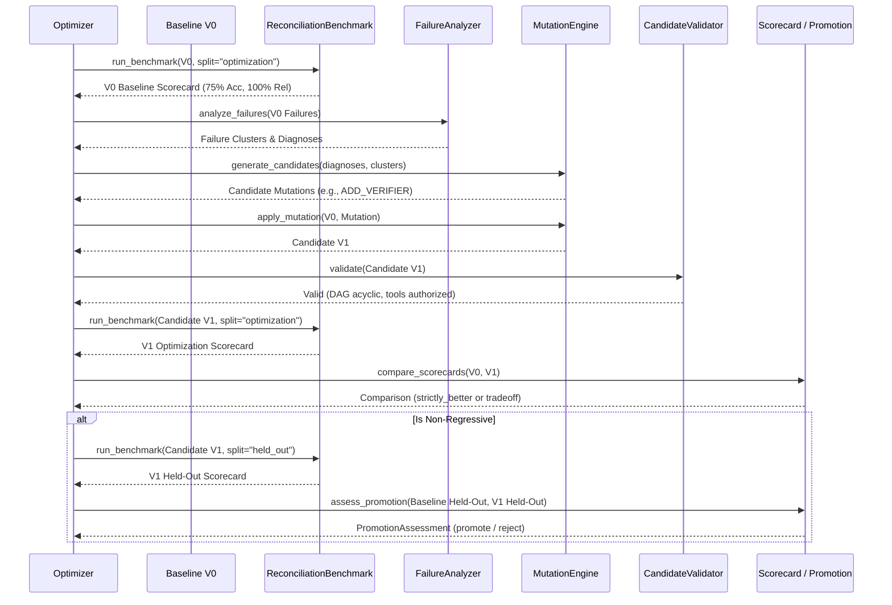

# RECO Mutation & Optimization Engine Specification

## 1. Executive Summary

The **Mutation & Optimization Engine** (`reco.mutation`) forms the core self-improvement mechanism of Reco. Consuming baseline agent architectures alongside diagnostic telemetry from `FailureAnalyzer`, the engine executes targeted, hypothesis-driven mutations to generate candidate agent versions ($V_{n+1}$).

Crucially, mutations are evaluated on real benchmark runs without simulated numbers or arbitrary code execution. Every mutation candidate undergoes a 7-stage static validation check before execution on the optimization split, and only eligible candidates are verified against held-out ground truth for promotion assessment.

```
+-----------------------------------------------------------------------------------+
|                                 Reco Core Loop                                    |
|                                                                                   |
|  Goal ---> Generator ---> Baseline V0 ---> FailureAnalyzer                        |
|                                                  | (Failure Clusters & Diags)     |
|                                                  v                                |
|                                          CandidateGenerator                       |
|                                                  | (Prioritized Hypotheses)       |
|                                                  v                                |
|                                           MutationEngine                          |
|                                                  | (Modular Mutator Suite)        |
|                                                  v                                |
|                                          CandidateValidator                       |
|                                                  | (7 Invariants Checked)         |
|                                                  v                                |
|                                        ReconciliationBenchmark                    |
|                                                  | (Optimization Split: 12 cases) |
|                                                  v                                |
|                                             Scorecard                             |
|                                                  | (Strict Comparison)            |
|                                                  v                                |
|                                        ReconciliationBenchmark                    |
|                                                  | (Held-Out Split: 8 cases)      |
|                                                  v                                |
|                                        PromotionAssessment                        |
|                                          [PROMOTE / REJECT]                       |
+-----------------------------------------------------------------------------------+
```

---

## 2. Architecture & Modular Mutator Hierarchy

To avoid monolithic mutation logic, mutations are encapsulated in specialized mutators subclassing `BaseMutator`:

```
reco.mutation
├── models.py                # MutationCandidate, AgentVersionCandidate, OptimizationResult
├── validation.py            # CandidateValidator (7-stage static checks)
├── generator.py             # CandidateGenerator (cluster-weighted hypothesis selection)
├── engine.py                # MutationEngine (orchestrates generate, mutate, evaluate, promote)
└── mutators/
    ├── base.py              # BaseMutator with deepcopy/clone_graph isolation
    ├── prompt.py            # PromptMutator (instructions, prefixes, appends, diffs)
    ├── tool.py              # ToolMutator (add, remove, reorder with anti-fabrication check)
    ├── topology.py          # TopologyMutator (insert node, add/remove/rewire edge)
    ├── verifier.py          # VerifierMutator (inserts audit/verification gates)
    ├── model.py             # ModelMutator (gateway-agnostic model routing/config updates)
    ├── routing.py           # RoutingMutator (edge transition conditions)
    ├── context.py           # ContextMutator (input_mapping & output_key projections)
    └── retry.py             # RetryPolicyMutator (bounded retry policies [0, 5])
```

---

## 3. Supported Mutation Types

| Mutation Type | Target Scope | Description | Safety Invariant |
| :--- | :--- | :--- | :--- |
| `PROMPT_CHANGE` | `NodeModel.system_prompt` | Targeted prompt refinement (e.g. role boundaries, exception rules). | Preserves audit trail; records old vs. new prompt. |
| `TOOL_ADD` | `NodeModel.tools` | Adds an existing, authorized tool from `ToolRegistry`. | Cannot fabricate unregistered or non-existent tools. |
| `TOOL_REMOVE` | `NodeModel.tools` | Prunes redundant tools from a node. | Cannot remove tools required by `TaskSpecification`. |
| `TOOL_REORDER` | `NodeModel.tools` | Changes execution order of bound tools. | Reordered list must be exact permutation of authorized tools. |
| `TOPOLOGY_CHANGE` | `GraphDefinition` | Adds/removes nodes and edges, rewires connections. | Graph must remain connected, acyclic, and depth-bounded. |
| `ADD_VERIFIER` | `GraphDefinition` | Inserts an auditor node between matching and terminal reporting. | Automatically updates edge routing and terminal nodes. |
| `MODEL_CHANGE` | `NodeModel.model_config_data` | Updates model selection (e.g., fast model to reasoning model). | Abstract configuration; no vendor API hardcoding. |
| `ROUTING_CHANGE` | `EdgeModel.condition` | Adjusts transition guard conditions. | Edges must connect valid existing nodes. |
| `CONTEXT_CHANGE` | `NodeModel.input_mapping` | Fixes state key mappings or output key projections. | Input mapping must be valid dictionary. |
| `RETRY_POLICY_CHANGE` | `NodeModel.max_retries` | Modifies retry counts and retryable errors. | Strictly bounded ($0 \le \text{max\_retries} \le 5$). |

---

## 4. Immutable Versioning

Agents in Reco are **strictly immutable**. When $V_0$ is mutated:
1. $V_0$ remains untouched.
2. A new `AgentVersionCandidate` ($V_1$) is created with:
   - `candidate_id`: Unique UUID4 identifier.
   - `parent_version_id`: Reference to $V_0$.
   - `version_number`: Incremented sequentially ($1, 2, \dots$).
   - Full deep-copied snapshots of graph topology, prompts, tool bindings, and configurations.
   - Complete audit trail of the applied `MutationCandidate`.

---

## 5. Static Validation Pipeline

Before any candidate is scheduled for benchmark execution, it is evaluated by `CandidateValidator` against 7 invariants:

1. **DAG Integrity & Acyclicity**: `graph.validate_graph()` verifies entry nodes, valid edges, and reachability.
2. **Complexity & Depth Bounds**: Node count ($\le 20$), edge count ($\le 50$), and graph depth ($\le 10$).
3. **Tool Authorization & Anti-Fabrication**: Every referenced tool on every node must exist in the `ToolRegistry`.
4. **Capability Coverage**: Mandatory tools specified by `TaskSpecification` or required bindings must be present.
5. **Mutation Target Validation**: Targets must exist in the graph, registry, or edge list.
6. **Context & Input Mapping Invariants**: Input mappings must reference valid state keys.
7. **Verification Invariants**: If verification is mandated by task requirements, audit gates are verified.

If any invariant fails, `is_valid` is set to `False`, `rejection_reason` is recorded, and execution is aborted without wasting benchmark compute.

---

## 6. Failure-Cluster Prioritization & Candidate Generation

`CandidateGenerator` prevents ad-hoc, random mutations by organizing diagnostic feedback:
1. **Cluster Prioritization**: Failure clusters produced by `FailureAnalyzer` are sorted by `priority_score = count * severity_weight`.
2. **Dominant Defect Focus**: Recurring failure modes (e.g., missing verification in 8 cases) are selected over single-occurrence anomalies.
3. **Traceability**: Candidate mutations record the diagnosis IDs and cluster IDs that motivated their creation.
4. **Bounded Generation**: Generation is capped at `max_candidates` (default = 3) to prevent combinatorial explosion.

---

## 7. Optimization vs. Held-Out Separation

Reco strictly prevents data leakage during optimization:
- **Optimization Split (12 cases)**: Used by `FailureAnalyzer` to diagnose errors and by `CandidateGenerator` to generate hypotheses.
- **Held-Out Split (8 cases)**: Strictly isolated. The mutation engine never reads held-out cases or ground truth during generation.
- **Verification Gate**: Only valid candidates that achieve non-regressive optimization scorecards are evaluated on the held-out split for promotion.

---

## 8. Benchmark Execution & Promotion Flow



---

## 9. Improvement Persistence

Every evaluation cycle generates an `ImprovementRecord` persisted in `ImprovementRepository`:
- `id`: Unique record ID.
- `experiment_id`: Associated experiment UUID.
- `parent_version_id`: Baseline agent version ID.
- `candidate_version_id`: Mutated agent version ID.
- `mutation_type`: Enum string (e.g., `add_verifier`, `prompt_change`).
- `mutation_description`: Human-readable summary of the applied modification.
- `rationale`: Engineering hypothesis for the change.
- `metrics_before` & `metrics_after`: Four-dimensional scorecard snapshots (accuracy, reliability, latency, cost).
- `accepted`: Boolean indicator of promotion status.
- `rejection_reason`: Explanation if promotion was rejected.

---

## 10. Empirical Closed-Loop Verification Experiment (Step 11A)

The complete end-to-end closed loop was executed against the Bank & Ledger Reconciliation Benchmark (`reconciliation-v1`) without simulated or mocked metrics:

### V0 Baseline Execution
- **Optimization Split (12 cases)**:
  - Total cases: 12 (8 passed, 4 failed)
  - Passed cases: `REC-OPT-01`, `REC-OPT-03`, `REC-OPT-04`, `REC-OPT-05`, `REC-OPT-06`, `REC-OPT-07`, `REC-OPT-10`, `REC-OPT-12` (all scoring 1.0)
  - Failed cases: `REC-OPT-02` (score 0.60), `REC-OPT-08` (score 0.40), `REC-OPT-09` (score 0.00), `REC-OPT-11` (score 0.00)
  - Accuracy: **0.7500** (75.0%)
  - Reliability: **1.0000** (100.0%, 0 runtime crashes)
  - Total Cost: **$0.006802** (avg $0.000567 / case)
  - Avg Latency: **0 ms**
- **Held-Out Split (8 cases)**:
  - Total cases: 8 (6 passed, 2 failed: `REC-HLD-02` score 0.60, `REC-HLD-08` score 0.00)
  - Accuracy: **0.8250** (82.5%)
  - Reliability: **1.0000** (100.0%)
  - Total Cost: **$0.004934** (avg $0.000617 / case)
  - Avg Latency: **0 ms**

### Failure Diagnosis & Clustering
`FailureAnalyzer` diagnosed the 4 failed optimization cases:
- `REC-OPT-08`: `HALLUCINATED_MATCH` (Severity: HIGH)
  - *Root Cause*: Matcher prompt and similarity threshold do not penalize vendor / counterparty identity mismatches when amounts match exactly.
  - *Recommended Mutation*: `PROMPT_CHANGE` on node `fuzzy_match` with rationale to enforce strict counterparty validation.
- `REC-OPT-02`, `REC-OPT-09`, `REC-OPT-11`: `UNKNOWN_FAILURE` (Severity: MEDIUM)
- **Clusters**:
  - `cluster-002` (`HALLUCINATED_MATCH`, count=1, priority_score=2.7) — selected as highest priority.
  - `cluster-001` (`UNKNOWN_FAILURE`, count=3, priority_score=2.4).

### Candidate V1 Mutation
- **Mutation Type**: `PROMPT_CHANGE`
- **Target**: `fuzzy_match`
- **Proposed Change**:
  ```json
  {
    "append": "Matcher prompt overvalues numerical amount alignment and lacks strict vendor token validation.",
    "target_node": "fuzzy_match"
  }
  ```
- **Validation**: 7/7 static pre-flight checks passed (`CandidateValidator`).

### Optimization Comparison (V0 vs V1)
- **V0 Optimization**: Accuracy 0.7500, Reliability 1.0000, Total Cost $0.006802, Latency 0 ms.
- **V1 Optimization**: Accuracy 0.7500, Reliability 1.0000, Total Cost $0.007138, Latency 0 ms.
- **Comparison Outcome**: Accuracy and reliability remained unchanged; cost increased slightly (+5.0%) due to additional prompt token length.

### Held-Out Comparison (V0 vs V1)
- **V0 Held-Out**: Accuracy 0.8250, Reliability 1.0000, Total Cost $0.004934, Latency 0 ms.
- **V1 Held-Out**: Accuracy 0.8250, Reliability 1.0000, Total Cost $0.005158, Latency 0 ms.
- **Deltas**: Accuracy +0.0 pp (82.5% -> 82.5%), Reliability +0.0 pp (100.0% -> 100.0%), Cost +4.5% ($0.000617 -> $0.000645 avg/case), Latency 0 ms.

### Promotion Result: REJECTED
- **Decision**: `REJECT`
- **Reasons**: `['Candidate regressed across dimensions: cost.']`
- **Engineering Verdict**: Under the strict, zero-regression `ComparisonPolicy`, candidate V1 was **honestly rejected**. Modifying the prompt without an accompanying change to the tool parameter bindings or model capability yielded identical match predictions while slightly increasing token consumption. Reco's promotion controller prevented promoting a cost-regressive version that yielded no accuracy benefit.
- **Data Leakage Check**: Instrumentation verified that held-out cases were accessed strictly post-candidate synthesis. Zero held-out data leaked into failure analysis or mutation generation.
